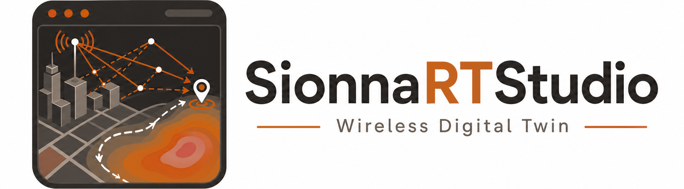

<div align="center">



**A browser-based wireless digital twin powered by NVIDIA Sionna RT GPU ray tracing.**

[](https://github.com/NVlabs/sionna-rt)
[](https://react.dev/)
[](https://www.typescriptlang.org/)
[](https://threejs.org/)
[](https://vitejs.dev/)
[](https://fastapi.tiangolo.com/)
[](https://www.python.org/)
[](https://developer.nvidia.com/cuda-toolkit)
[](LICENSE)

</div>

---

**SionnaRTStudio** turns any real-world location into an interactive wireless propagation
sandbox. Pick an area on a map, pull its buildings from **OpenStreetMap**, place
transmitters and receivers inside a 3D digital twin, and run **NVIDIA
[Sionna RT](https://github.com/NVlabs/sionna-rt)** GPU ray tracing — multipath links,
coverage maps, multi-transmitter receiver mobility with 3GPP A3 handover analysis,
Shannon-capacity link KPIs, an optional standard-compliant 5G NR PUSCH BER/BLER
chain, and notebook-grade channel-response exports (CIR / CFR) — all from the
browser.

> **New to SionnaRTStudio?** Follow the
> **[complete step-by-step tutorial](https://puloktarafder.github.io/posts/2026/08/sionnartstudio-tutorial/)**
> for setup, interface navigation, ray-traced links, coverage maps, mobility
> trajectories, analysis tools, research exports, and standalone Sionna RT
> notebook workflows.

## Table of contents

- [Requirements](#requirements)
- [Quick start](#quick-start)
  - [Windows (WSL2)](#windows-wsl2)
  - [How Node is resolved](#how-node-is-resolved)
- [Features](#features)
- [Architecture](#architecture)
- [Using it](#using-it)
- [Channel-response exports (CIR / CFR)](#channel-response-exports-cir--cfr)
- [Standalone Sionna RT scene export](#standalone-sionna-rt-scene-export)
- [Freezing an OSM scene](#freezing-an-osm-scene)
- [Running the tests](#running-the-tests)
- [Troubleshooting](#troubleshooting)
- [Notes](#notes)
- [Citation](#citation)
- [License](#license)

## Requirements

- **Linux, macOS, and Windows via WSL2** — `setup.sh` and `run.sh` are bash scripts that
  assume a POSIX venv layout, so there is no native Windows (cmd/PowerShell)
  path. See [Windows (WSL2)](#windows-wsl2). macOS installs on Apple Silicon and
  runs CPU-only; Intel Macs have no Mitsuba wheel at all.
- **NVIDIA GPU + CUDA** — strongly recommended, not required. Ray tracing prefers
  Mitsuba's `cuda_ad_mono_polarized` variant and falls back to the CPU
  (`llvm_ad_mono_polarized`) when no usable GPU is present. Results are
  identical; only speed differs. `GET /api/health` reports the active `variant`
  and a `gpu` boolean. Whether a VM sees the GPU depends entirely on the
  hypervisor: **WSL2 passes an NVIDIA GPU through, VirtualBox does not.**
- **LLVM runtime — only on machines with no CUDA GPU.** Dr.Jit's CPU backend
  `dlopen`s a system `libLLVM`; it is *not* bundled in the wheel, and a clean
  Ubuntu image frequently has none. Without it the backend cannot start at all:
  `sudo apt install llvm-runtime`. `setup.sh` probes for this and tells you.
- **Linux x86-64 needs glibc 2.28+** (Ubuntu 20.04 and newer) for the Mitsuba
  wheel; arm64 needs 2.17+. Ubuntu 18.04 is too old to install at all.
- **Python 3.11–3.13**, and 3.14 works with one caveat. Every pinned wheel
  covers 3.9–3.14 except `numpy==2.2.6`, whose wheels stop at 3.13, so on a 3.14
  interpreter the requirements resolve numpy to 2.3.2+ instead. `setup.sh` picks
  the newest interpreter within the pinned range when the machine has one, and
  says so when it has to go above it. This matters on Ubuntu 26.04, whose
  default `python3` is 3.14.
- **`python3-venv`** is a separate Debian/Ubuntu package and is absent from
  fresh images, including WSL ones: `sudo apt update && sudo apt install
  python3-venv`. The `apt update` is not optional on a fresh image, or the
  package appears to have "no installation candidate".
- **Node.js 20+** — optional. If the machine has no Node, or one older than 20
  (Ubuntu 24.04's `apt install nodejs` still ships 18), `setup.sh` downloads a
  pinned Node into `./.node` automatically. No sudo, no system packages.

## Quick start

```bash
./setup.sh     # once: installs Node if needed + frontend deps + a Python venv with Sionna
./run.sh       # starts backend (:8000) + frontend (:3000); Ctrl+C stops both
```

(or `npm run setup` / `npm start`). Then open **http://localhost:3000**.
The header badge shows **RT-CORE ONLINE** when the backend is reachable.

Environment variables override the defaults:

| Variable | Default | Purpose |
| -------- | ------- | ------- |
| `SRTS_PYTHON` | `./.venv/bin/python` | Point at an existing Python environment that already has Sionna, instead of the local venv. Read by `setup.sh` and `run.sh`. |
| `SRTS_BACKEND_PORT` | `8000` | Move the backend off port 8000 when something else holds it. Read by both `run.sh` and the Vite proxy, so the frontend follows automatically. |
| `SRTS_NODE_VERSION` | `22.23.1` | Which Node to fetch when `setup.sh` installs one into `./.node`. |
| `SRTS_NODE_INSTALL` | `auto` | Set to `off` to forbid the automatic Node download; `setup.sh` then fails if no Node 20+ is on `PATH`. |

```bash
SRTS_PYTHON=/path/to/venv/bin/python ./run.sh
SRTS_BACKEND_PORT=8011 ./run.sh
SRTS_NODE_INSTALL=off ./setup.sh
```

### Windows (WSL2)

There is no native Windows path — `setup.sh` / `run.sh` are bash and expect
`.venv/bin/`, not `.venv/Scripts/`. Run the project inside **WSL2**, which is
also the only Windows option that gives the guest a real GPU: unlike VirtualBox,
WSL2 passes an NVIDIA card straight through, so you get genuine CUDA ray tracing
rather than the CPU fallback.

```powershell
wsl --install -d Ubuntu     # in an admin PowerShell, then reboot
wsl -l -v                   # the VERSION column must read 2
```

> **WSL1 cannot run this project.** WSL1 translates Linux syscalls onto the NT
> kernel instead of running a real one, and Dr.Jit's native extension does not
> load there. The failure is confusing rather than obvious: `pip` installs every
> requirement successfully, then `import sionna` dies inside the native library.
> If `wsl -l -v` shows version 1, convert the distro and re-run `./setup.sh`:
>
> ```powershell
> wsl --set-default-version 2          # for distros installed later
> wsl --set-version Ubuntu-24.04 2     # for one already installed
> ```
>
> If `--set-version 2` fails, Windows itself lacks hardware virtualization. On a
> physical machine, enable Virtual Machine Platform and VT-x/AMD-V in firmware.
> When Windows is a VirtualBox guest, the host must expose nested virtualization
> (`VBoxManage modifyvm <vm> --nested-hw-virt on`).

Then, **in Windows** (not inside WSL), install the normal NVIDIA display driver.
That is the whole GPU setup — the driver exposes CUDA to the guest through
`/usr/lib/wsl/lib`, and no CUDA toolkit is needed.

> **Do not install a Linux NVIDIA driver inside WSL.** It overwrites the
> passthrough stubs and breaks GPU access. This is the most common way to end up
> with a WSL2 box that cannot see the card.

Inside the Ubuntu shell, confirm the GPU is visible, then set up as usual:

```bash
nvidia-smi                  # should list your card; if not, fix that first

# A fresh WSL image has no python3-venv, and setup.sh cannot build ./.venv
# without it. The index refresh is not optional on a new image — without it
# apt reports "Package 'python3-venv' has no installation candidate".
sudo apt update && sudo apt install -y python3-venv

git clone https://github.com/puloktarafder/SionnaRTStudio.git
cd SionnaRTStudio
./setup.sh && ./run.sh
```

Open **http://localhost:3000** in the Windows browser — WSL2 forwards localhost
automatically, so no port configuration is needed.

Two things worth knowing:

- **Keep the checkout on the Linux filesystem** (`~/…`, not `/mnt/c/…`). Vite's
  file watching and npm installs are dramatically slower across the `/mnt/c`
  boundary.
- **No NVIDIA GPU?** WSL2 still works; it just runs the CPU variant, so install
  the LLVM runtime first: `sudo apt install llvm-runtime`.

### How Node is resolved

`setup.sh` and `run.sh` prefer `./.node/bin` over the system Node, so a
project-local install wins without touching anything outside this folder:

1. `./.node/bin/node`, if a previous `setup.sh` put one there.
2. Otherwise the system `node`, if it is v20 or newer.
3. Otherwise `setup.sh` downloads the official Node tarball for this
   platform, verifies it against the published `SHASUMS256.txt`, and unpacks it
   into `./.node`.

`.node/` is gitignored and adds ~200 MB. Delete it to fall back to the system
Node, or to force a re-download on the next `setup.sh`.

## Features

- **GIS digital twin** — fetch building footprints, roads, parks, and water for any
  bounding box via the OpenStreetMap Overpass API; rendered as an interactive
  Three.js 3D scene with ITU radio materials per building.
- **Link analysis** — GPU ray tracing between any Tx/Rx pair: multipath rays in 3D,
  CIR taps, RX power, RMS delay spread, LOS/NLOS. Supports multiple transmitters
  and receivers with an all-pairs link matrix.
- **Beamforming** — configurable antenna array size, pattern (isotropic, dipole,
  half-wave dipole, 3GPP TR 38.901), polarization (V / H / VH / cross), and
  azimuth/elevation beamsteering that the solver genuinely applies.
- **Ray interaction control** — toggle line-of-sight, specular reflection, diffuse
  reflection, refraction, diffraction, and edge diffraction per solve
  (applies to links, mobility, and radio maps alike). PathSolver samples/source
  and seed are explicit, separately from radio-map Monte Carlo controls.
- **Radio coverage maps** — Sionna `RadioMapSolver` with best-server combining
  across transmitters; viridis/plasma/inferno/turbo colormaps with auto or
  manual vmin/vmax range. Monte Carlo rays/Tx and a deterministic seed are
  explicit controls and are returned with each grid for reproducibility.
- **Mobility (multi-transmitter)** — draw a receiver trajectory in the 3D scene (or
  generate a loop), then ray-trace **every transmitter** to each sampled position
  on the GPU (all Tx × all waypoints batched into one `PathSolver` dispatch). The
  API returns execution telemetry, and the UI visibly warns if the defensive serial
  fallback was used. Play it back: the receiver moves along the path while the rays
  from every transmitter, RX power, Doppler, delay spread, and LOS status update at
  every step, with a step scrubber and looping playback. A per-run **Best-server / Sum
  power** toggle picks how the multiple transmitters collapse into each step's KPIs:
  - **Best-server** — the single strongest Tx supplies the metrics and is highlighted
    as the serving cell, so you can inspect instantaneous **serving-cell
    transitions** as the receiver moves (no hysteresis or time-to-trigger is
    implied).
  - **Sum power** — non-coherently sums incident powers. It does not merge
    cross-transmitter delays/phases or invent a joint delay spread without an
    inter-cell synchronization model; per-Tx delay spreads remain available.

  Either way the scene renders the union of every transmitter's rays, and a per-Tx RSS
  / LOS breakdown is shown for each waypoint. Add transmitters right in the Trajectory
  panel; all Tx share one antenna array (matching `antennaArraySize` required).
- **A3 handover analysis** — on top of the instantaneous best-server association,
  the mobility solve runs the 3GPP A3 event model (hysteresis + time-to-trigger,
  honored in seconds via waypoint spacing and speed) over the per-Tx RSS series:
  serving-cell series, handover events (clickable — they jump the playback),
  ping-pong count, and the hysteresis-free switch count as the baseline.
- **Link-level KPIs (Shannon)** — one click re-traces the active link, samples
  `paths.cfr()` on a configurable OFDM grid and reduces it to capacity KPIs:
  open-loop vs MRT vs the steered uniform beam actually applied (their gap is the
  measured beamforming gain), spectral efficiency and throughput, transmit-covariance
  effective rank / condition number, coherence bandwidth, and a link-budget
  effective SNR. Pure NumPy on the backend — no PHY package needed.
- **PHY BER/BLER (optional)** — with the optional Sionna PHY package installed
  (`pip install -r backend/requirements-phy.txt`), the ray-traced channel is
  replayed through the standard-compliant 5G NR PUSCH chain (LDPC transport
  blocks, QAM, DMRS-based estimation, LMMSE) as the reciprocal uplink, sweeping
  Eb/N0 to a BER/BLER waterfall — as a background job with live progress. The
  PHY runs CPU-pinned so the GPU stays exclusive to the ray tracer.
- **CIR / CFR export** — re-run `PathSolver` for the active link or every Tx/Rx
  in one scene dispatch. Download raw `a, tau = paths.cir()` without an OFDM
  grid, or include `h = paths.cfr()` over configurable subcarriers. Multi-device
  NPZ files preserve Sionna's full receiver/antenna/transmitter tensor axes.
- **Standalone Sionna RT scene export** — download the exact Mitsuba scene the
  backend ray-traces (`scene.xml` with ITU radio-material BSDFs plus one `.ply`
  per building) alongside a generated `load_scene.py` that replays everything
  Sionna keeps in Python rather than in the XML: carrier frequency, material
  overrides, the `PlanarArray` config, every Tx/Rx, and the `PathSolver`
  switches. Run it in a plain notebook to reproduce a solve with no app in the
  loop.
- **Project save / restore** — editable scene state autosaves in the browser. A
  versioned project JSON can also be exported and imported to move the complete
  geometry, Tx/Rx and antenna settings, solver/material controls, trajectory,
  coverage controls, and display choices between runs or computers. Computed
  rays and maps are deliberately regenerated after loading.
- **Scene & dataset export** — GeoJSON / Wavefront OBJ / propagation CSV scene exports,
  plus two clearly separated channel-grid paths: a coverage-derived JSON proxy
  whose `H` is synthesized from map power, and a backend `.npz` containing
  ray-traced per-cell MIMO CFR from `paths.cfr()` with the active Tx and Rx
  array-port axes. This is not a standardized third-party scenario package.

## Architecture

```
┌────────────────────────────┐         ┌──────────────────────────────┐
│  Frontend (port 3000)      │  /api   │  Backend (port 8000)         │
│  React + Three.js + Vite   │ ──────► │  FastAPI + Sionna RT         │
│  src/                      │  proxy  │  backend/                    │
│  • 3D scene & map UI       │         │  • Mitsuba scene from OSM    │
│  • playback & charts       │         │    footprints (ENU meters)   │
│  • exporters (CIR/CFR…)    │         │  • PathSolver / RadioMap-    │
│                            │         │    Solver on CUDA            │
└────────────────────────────┘         └──────────────────────────────┘
```

The backend builds a Sionna/Mitsuba scene from the same ENU building footprints
the frontend renders (cached by geometry hash). The API therefore needs no
geodetic reprojection; the renderer maps ENU values into Three.js as
`(X, Y, Z) = (east, up, -north)`.

## Using it

1. **Geography** — pan the Leaflet map to an area and press
   **Fetch OSM Physical Twin** to download real buildings (or keep the preloaded
   demo city).
2. **Link Analysis** — place Tx/Rx (map drag, *Place TX/RX* in the 3D scene, or
   sliders), set frequency / max depth / ray interactions, press
   **Solve Link · Sionna RT**. With multiple devices, **Solve All Pairs** fills
   the link matrix; click a cell to focus that pair.
3. **Radio Coverage** — choose grid step and height, press
   **Map Coverage Matrix Grid**. Adjust the colormap and range under *Display*.
4. **Trajectory** (mobility) — add/select transmitters in the panel (**+ Add** under
   *Transmitters ray-traced to the path*), pick the **Best-server / Sum power** KPI
   mode, press **Draw Path** and click waypoints in the 3D scene, then **Run Mobility ·
   Sionna RT** (every transmitter is ray-traced to each sampled position, capped at
   100). Press **Play** to watch the receiver move with live per-position rays and
   metrics — including the serving Tx and a per-Tx RSS breakdown; drag the scrubber to
   inspect any step. With two or more transmitters, the **A3 handover** card sets
   hysteresis (0–15 dB) and time-to-trigger; after a run, handover events are listed
   and clicking one jumps the playback to that waypoint.
5. **Analysis** — after solving a link, **Compute KPIs** reduces its ray-traced CFR
   to Shannon-capacity KPIs (open-loop vs MRT vs the applied steered beam, coherence
   bandwidth, effective rank, link-budget SNR), and — with the optional PHY package —
   **Run BER Sweep** replays the channel through the 5G NR PUSCH chain to a BER/BLER
   waterfall as a background job with live progress.
6. **Export** — use **Export Project** / **Import Project** for a reloadable
   SionnaRTStudio project, or download the scene (OBJ / GeoJSON), propagation
   report (CSV), channel response (CIR / CFR), or a ray-traced channel grid /
   explicitly labeled coverage proxy. **Scene + load_scene.py (.zip)** exports the
   ray-traced Mitsuba scene as a standalone Sionna RT project that runs outside
   the app. Editable project inputs also autosave in the current browser.

## Channel-response exports (CIR / CFR)

The **Export** tab can reproduce the standard Sionna notebook workflow directly
from the browser. The **CIR & CFR Export** card re-runs `PathSolver` for either
the active link or, with **Export all Tx × Rx as one scene tensor**, every
device in one dispatch:

| Output | Description |
| ------ | ----------- |
| `a` | Complex baseband path coefficients (channel impulse response) |
| `tau` | Path delays in seconds |
| `h_freq` | Channel frequency response over the OFDM subcarrier grid |
| `frequencies` | Baseband subcarrier offsets (Hz) |

The **Raw a, tau (.npz)** button does not build a subcarrier grid or evaluate
`paths.cfr()`. The combined NPZ uses the selected subcarrier count and spacing.
Both honor delay normalization (`tau_0 = 0`). Multi-device CSV is intentionally
disabled because flattening its device and antenna axes would be ambiguous.

If array sizes differ, the card offers **Export all-pairs ZIP** instead of
forcing heterogeneous devices into an invalid dense tensor. The backend
retraces every pair with its actual Tx/Rx arrays and writes `cir/*.npz` plus
`manifest.json`. The earlier **Solve All Pairs** matrix cannot be reused because
it retains display rays and KPIs, not the full complex CIR tensors.

The `.npz` loads straight into Python:

```python
import numpy as np
d = np.load("sionna_rt_studio_cir_cfr.npz")
a, tau, h = d["a"], d["tau"], d["h_freq"]   # CIR coeffs, delays [s], CFR
print(a.shape)   # [num_rx, num_rx_ant, num_tx, num_tx_ant, paths, time]
print(tau.shape) # [num_rx, num_rx_ant, num_tx, num_tx_ant, paths]
```

With synthetic arrays, Sionna internally shares geometric delays across antenna
ports. The export broadcasts `tau` over those antenna axes to match the tutorial
layout and also stores the unbroadcast native values as `tau_geometric`.
`tx_ids`, `rx_ids`, names, positions, array sizes, and device counts label the
tensor axes.

Single-link CIR and CFR CSV variants remain available for quick inspection.
This mirrors:

```python
p_solver = PathSolver()
paths = p_solver(scene, max_depth=...)
a, tau = paths.cir(normalize_delays=True)
h = paths.cfr(frequencies=subcarrier_frequencies(num_subcarriers, subcarrier_spacing))
```

See [`backend/README.md`](backend/README.md) for the full API reference.

## Standalone Sionna RT scene export

The **Export** tab's *Sionna RT Scene Export* card downloads the ray-tracing
scene as a self-contained Sionna RT project, so a solve can be reproduced with
no app in the loop. Every mesh reference in the XML is relative, so the
directory is relocatable as-is.

| Member | Contents |
| ------ | -------- |
| `scene.xml` | Mitsuba scene with ITU radio-material BSDFs and relative mesh paths |
| `meshes/*.ply` | Ground plane plus one extruded prism per building |
| `load_scene.py` | Replays the Python-side setup Sionna keeps out of the XML |
| `manifest.json` | The exact settings this export was generated from |
| `README.md` | Usage notes for the bundle itself |

The XML cannot carry what Sionna holds on the Python side, which is why the
generated script exists. It replays the carrier frequency, radio-material
overrides, the `PlanarArray` configuration, every transmitter/receiver (with
each Tx's configured `power_dbm`), and the `PathSolver` interaction switches,
ending in `paths.cir()` / `paths.cfr()`:

```bash
pip install sionna-rt
python load_scene.py       # writes cir.npz next to the script
```

For a uniform-array scene the script writes a single `cir.npz`. When device
array sizes differ, one dense tensor is impossible — a Sionna scene has one
shared Tx array and one shared Rx array — so the script groups devices by exact
array-size pair and writes one tensor per compatible combination under
`channels/`, with `manifest.json` mapping each group to its file. Together they
cover every Tx×Rx pair without padding or replacing any antenna array.

Coordinates are ENU metres (x=East, y=North, z=Up) with the ground plane at
z=0, matching the rest of the app. Device heights are roof-aware: a device over
a building footprint sits on it.

## Freezing an OSM scene

Both the browser and freezer call `src/utils.ts::parseOsmElements`:

```bash
npm run check:osm-parser
npm run freeze:osm-scene
```

The freezer writes the raw Overpass payload, all visual features, backend-ready
buildings, and `osm_scene_manifest.json` with the query, bounds, counts, runtime,
and SHA-256 hashes under `artifacts/osm-scene/` by default. Use `--out-dir` to
choose another destination. Re-run it only when intentionally creating a new
dated scene snapshot; experiments should cite the frozen hashes.

## Running the tests

The backend suite covers the pure-math pieces — solver reductions, link-level
KPIs, the A3 handover state machine, and scene-export packaging. **None of it
needs a GPU or a Sionna scene build**, so it runs anywhere in well under a
second:

```bash
./.venv/bin/python -m unittest discover backend/tests
```

| Suite | Covers |
| ----- | ------ |
| `test_solver_math.py` | Beamforming, channel metrics, coverage stats, geometry hashing |
| `test_linklevel.py` | Shannon-capacity KPI reduction (open-loop / MRT / steered) |
| `test_handover.py` | 3GPP A3 hysteresis + time-to-trigger state machine |
| `test_scene_export.py` | Standalone scene bundle contents and manifest |

Two frontend checks round it out — both offline, both fixture-based:

```bash
npm run check:osm-parser   # pins the shared OSM parser against a fixture
npm run lint               # tsc --noEmit
```

`npm run check:osm-parser` guards `src/utils.ts::parseOsmElements`, which the
browser and the scene freezer both call — it is the one piece of parsing where
a silent regression would desynchronize the rendered scene from a frozen
snapshot.

## Troubleshooting

**`RT-CORE ONLINE` never appears / requests fail.** The backend is unreachable.
Confirm it is up and check which port it took: `curl localhost:8000/api/health`.
If something else already holds 8000, restart with `SRTS_BACKEND_PORT=8011
./run.sh` — the Vite proxy reads the same variable, so the frontend follows.

**WSL2: `/api/health` reports `"gpu": false` even though the machine has an
NVIDIA card.** Run `nvidia-smi` inside the WSL shell. If it fails there but
works in Windows, the passthrough is broken — almost always because a Linux
NVIDIA driver was installed inside WSL, which overwrites the stub libraries in
`/usr/lib/wsl/lib`. Only the Windows-side driver should ever be installed.
Failing that, `wsl --update` and restart with `wsl --shutdown`.

**`run.sh` says the Python cannot import sionna/fastapi, but `pip` reports
everything already satisfied.** The packages really are installed. `import
sionna` loads Dr.Jit's native extension, so the import fails for a reason that
has nothing to do with the package set. Read the traceback `run.sh` prints. Two
causes account for nearly all of these: the distro is WSL1 rather than WSL2
(check `wsl -l -v` in PowerShell, see [Windows (WSL2)](#windows-wsl2)), or the
LLVM runtime is missing on a machine with no CUDA GPU (`sudo apt install
llvm-runtime`). A `setup.sh` run that ended in "Mitsuba could not be imported"
rather than a variant line points at the same problem.

**`setup.sh` fails installing numpy with "Unknown compiler(s)" or "Preparing
metadata (pyproject.toml) did not run successfully".** pip found no prebuilt
wheel for this interpreter and fell back to compiling from source, which needs a
C toolchain the machine does not have. The usual cause is a Python newer than
the pinned wheel set, such as Ubuntu 26.04's default 3.14 against
`numpy==2.2.6`. Install a Python 3.11–3.13 with its matching `-venv` package and
re-run `setup.sh`, which prefers it automatically. Adding a compiler
(`sudo apt install build-essential`) also works but builds numpy from source for
several minutes.

**Backend refuses to start: "No usable Mitsuba variant".** The machine has no
CUDA GPU *and* no LLVM runtime for the CPU fallback, so there is nothing to
trace rays with. `sudo apt install llvm-runtime` (Dr.Jit loads `libLLVM` from
the system; it is not part of the wheel), or set `DRJIT_LIBLLVM_PATH` to an
existing one. This is the usual state of a freshly installed Ubuntu VM.

**The web UI loads but the badge stays `RT-CORE OFFLINE`.** Vite and the backend
are separate processes — `run.sh` starts uvicorn in the background and the
frontend in the foreground, so the page serves fine even when the backend died
on startup. Look at the `run.sh` output for a Python traceback, or hit
`curl localhost:8000/api/health` directly to see the real error. Nothing about a
blank badge is a frontend problem.

**Solves are slow, and `/api/health` reports `"gpu": false`.** Rays are being
traced on the CPU. Startup prefers `cuda_ad_mono_polarized` and falls back to
`llvm_ad_mono_polarized` whenever CUDA cannot initialize, logging
`[startup] WARNING: no CUDA GPU`. Results are identical either way — only the
speed differs. Common causes: running inside a VM (VirtualBox and friends give
the guest no access to the host GPU without passthrough, so this is expected and
unavoidable there), no NVIDIA card, or a driver/library mismatch — check whether
`nvidia-smi` runs at all, and reinstall `mitsuba` against a working CUDA toolkit
if it does.

**Rays pass straight through buildings.** Almost always a missing
`mapbox_earcut` — trimesh cannot triangulate the footprints, so buildings never
mesh and drop out of the ray-traced scene entirely. The browser gives no hint,
but the backend log does: look for `[scene_build] WARNING: failed to extrude
building`. Fix with `pip install mapbox_earcut` (it is in
`backend/requirements.txt` for exactly this reason).

**Fetching OSM fails.** The app tries two Overpass mirrors in order
(`overpass-api.de`, then `overpass.kumi.systems`) with a 25-second query
timeout, and reports the last error from each. Public Overpass instances rate-
limit aggressively; a `429` or `504` from both usually just means wait, or draw
a smaller bounding box.

**`Run BER Sweep` is unavailable.** The Sionna PHY package is optional and not
installed by `setup.sh`. `/api/health` reports it as `"phy"`. Install with
`pip install -r backend/requirements-phy.txt` (~4 GB with torch). A second
concurrent sweep returns `409` — only one job runs at a time.

**Frontend changes do not appear.** Hard-refresh the tab; Vite's cached module
graph survives an ordinary reload.

**`setup.sh` cannot download Node.** It needs `curl` or `wget`, plus `tar` and
`xz`, and prints which one is missing — on a minimal Ubuntu image install them
with `sudo apt install curl xz-utils`. Behind a proxy or with no network, get
Node 20+ onto `PATH` yourself and re-run with `SRTS_NODE_INSTALL=off ./setup.sh`
to skip the download entirely. Automatic install covers Linux and macOS on
x86-64 and arm64; anywhere else it stops and asks you to install Node manually.

## Notes

- Only `category:"building"` footprints are ray-traced (a ground plane is added
  automatically); roads/parks/water are visual-only.
- Multipolygon outer rings are preserved; interior courtyard rings are not yet
  represented by the current simple footprint schema.
- Diffuse reflection and refraction add many ray branches — expect slower solves,
  especially on radio maps.
- Tx and Rx arrays are physical Sionna `PlanarArray` objects with configurable
  size, pattern, and polarization. PathSolver uses synthetic arrays (device-center
  tracing plus Sionna's per-port phase application); scalar RSS sums the resulting
  Rx-port powers rather than adding an analytic `10·log10(Nr)` term.
- Sionna `RadioMapSolver` uses its own ideal dual-polarized isotropic receiver,
  so configured Rx arrays apply to links, mobility, CIR/CFR, link KPIs, PHY
  replay, and ray-traced channel-grid export—not to the coverage heatmap.
- Link/mobility channel KPIs (total power, RMS delay spread, path count) are
  computed over the **full** Sionna path set; only the rays drawn in the 3D view
  are capped (to the 15 strongest) for legibility.
- **Refraction** is approximate for solid structures. Sionna RT models each surface
  as a flat slab and folds wall thickness into the transmission coefficient;
  buildings here are closed prisms, so a transmitted ray crosses two wall slabs
  (entry + exit), each costing a `max_depth` bounce. Reflection and LOS occlusion
  are unaffected.
- The radio map's per-cell **LOS flag** is a 2D-footprint geometric approximation
  (Sionna's `RadioMapSolver` returns path gain / RSS / SINR, not per-cell LOS), so
  treat it as a hint, not ground truth.

## Citation

Paper coming soon.

## License

Apache-2.0. See [NOTICE](NOTICE) for third-party notices. Map data ©
[OpenStreetMap](https://www.openstreetmap.org/copyright) contributors. Sionna RT
is © NVIDIA Corporation (Apache-2.0).
